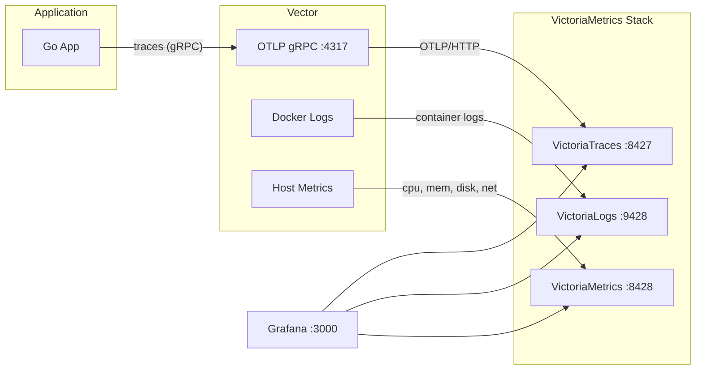

# victoria-o11y-lab

A hands-on learning project for the **Victoria Metrics observability stack**, demonstrating
metrics, traces, and logs collection from a Go HTTP service.

## Architecture



## Quick Start

```bash
# Start app + database
make dc-up

# Start observability stack
make dc-o11y-up

# Start everything
make dc-all-up
```

## Services

| Service | Port | URL |
|---------|------|-----|
| Grafana | 3000 | http://localhost:3000 |
| VictoriaMetrics | 8428 | http://localhost:8428 |
| VictoriaLogs | 9428 | http://localhost:9428 |
| VictoriaTraces | 8427 | http://localhost:8427 |
| Vector (OTLP gRPC) | 4317 | — |
| PostgreSQL | 5432 | — |